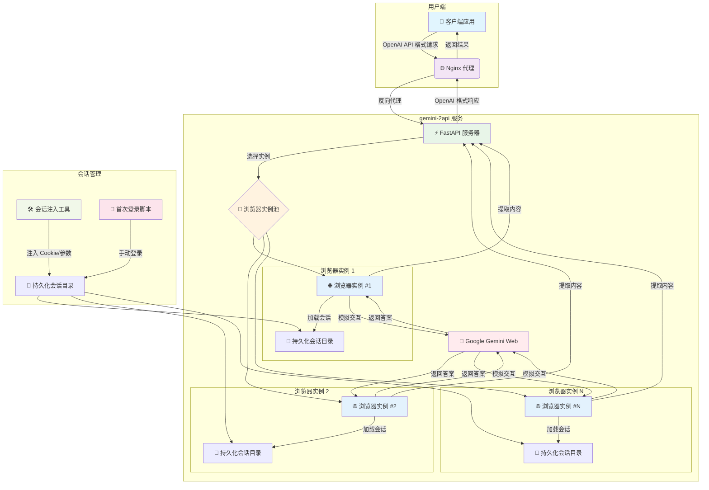

# ✨ Gemini-2API: 🚀 将 Gemini (Web) 转换为兼容 OpenAI 格式的高性能 API

[](https://github.com/lza6/gemini.google-2api-docker)
[](https://hub.docker.com/r/lza6/gemini-2api)
[](https://opensource.org/licenses/Apache-2.0)
[](https://www.python.org/downloads/)

## 🌟 核心价值与开源精神

> **💡 赋能·自由·探索**：我们相信技术的力量在于开放和共享。`gemini-2api` 的诞生，旨在让每一位开发者都能以更便捷、更灵活的方式探索前沿 AI 技术（如 Google 的 Gemini 模型），并将其无缝集成到自己的应用生态中。这个项目不仅是一个工具，更是一种精神——**"他能做到，你也能做到！"**。我们鼓励您动手实践，共同参与到开源的洪流中，推动技术进步，践行开放、创新、正直的黑客精神！

---

## 📋 项目概览

`gemini-2api` 是一个创新的代理服务，巧妙地利用 **Playwright** 浏览器自动化技术，将对 **Google Gemini (Web)** 网页端的交互，转化为兼容 **OpenAI Chat Completions API** 格式的接口。

### 🎯 核心优势

| 维度 | 优势描述 |
| :--- | :--- |
| **🔌 兼容性** | 无缝兼容 OpenAI API 生态，无需学习新规范 |
| **🔄 可复用性** | 持久化会话管理，支持多账号轮询 |
| **⚡️ 高性能** | 伪流式响应（SSE 模拟），提升用户体验 |
| **🐳 易部署** | Docker 容器化，解决环境配置难题 |
| **🛡️ 稳定性** | 浏览器实例池 + 异步锁机制，保证服务稳定 |

### 🏗️ 系统架构图



### 🔧 技术栈详解

| 组件 | 作用 | 技术亮点 |
| :--- | :--- | :--- |
| **Playwright** | 浏览器自动化核心 | 无头浏览器操作，模拟真实用户交互 |
| **FastAPI** | API 服务框架 | 高性能异步处理，OpenAPI 文档自动生成 |
| **Nginx** | 反向代理 | 负载均衡，流式传输优化 |
| **Docker** | 容器化部署 | 环境隔离，一键部署 |
| **SSE** | 伪流式传输 | 服务器发送事件，模拟实时响应 |

---

## 📂 项目结构

```text
📦 gemini-2api/
├── 📄 .env                    # 环境变量配置（API密钥、端口等）
├── 📄 .env.example           # 环境变量模板
├── 📄 Dockerfile             # Docker 镜像构建文件
├── 📄 docker-compose.yml     # Docker Compose 编排文件
├── 📄 inject_session.py      # ⭐ 会话注入工具（GUI/CLI）
├── 📄 main.py                # FastAPI 应用入口
├── 📄 nginx.conf             # Nginx 配置
├── 📄 requirements.txt       # Python 依赖列表
├── 📁 app/
│   ├── 📁 core/
│   │   ├── __init__.py
│   │   └── config.py         # 应用配置管理
│   ├── 📁 playwright_utils/
│   │   └── initial_login.py  # 首次登录引导脚本
│   ├── 📁 providers/
│   │   ├── __init__.py
│   │   ├── base_provider.py  # Provider 抽象基类
│   │   └── gemini_provider.py # Gemini 业务逻辑核心
│   └── 📁 utils/
│       ├── __init__.py
│       └── sse_utils.py      # SSE 流式传输工具
└── 📁 debug/                 # 调试文件存储
    ├── 📁 screenshots/       # 屏幕截图
    └── 📁 videos/            # 操作录屏
```

---

## 🚀 快速开始

### 1. 环境准备

确保已安装：
- 🐳 **Docker** 和 **Docker Compose**
- 🐍 **Python 3.11+**（仅用于运行会话注入工具）

### 2. 克隆项目

```bash
git clone https://github.com/lza6/gemini.google-2api-docker.git
cd gemini.google-2api-docker
```

### 3. 配置环境变量

```bash
# 复制配置文件模板
cp .env.example .env

# 编辑 .env 文件，至少修改以下配置
API_MASTER_KEY=your-secure-api-key-here  # 🔑 设置安全的API密钥
NGINX_PORT=8088                          # 🌐 设置服务端口
```

### 4. 准备会话（两种方式）

#### 方式一：使用会话注入工具（推荐 ✅）

1. **抓取 StreamGenerate 请求**
   - 打开 Chrome/Edge 浏览器，登录 Gemini 网页
   - 按 **F12** 打开开发者工具
   - 切换到 **Network** 标签页
   - 清空网络记录
   - 在 Gemini 中发送一条消息
   - 找到 `StreamGenerate` POST 请求
   - 右键 → **Copy** → **Copy as HAR**

2. **运行注入工具**
   ```bash
   python inject_session.py
   ```
   
3. **在 GUI 中操作**
   - 粘贴 HAR 内容到主输入框
   - 点击 **"自动创建新目录"**
   - 点击 **"🚀 开始注入会话"**
   - 等待完成提示

#### 方式二：首次登录脚本

```bash
# 创建会话目录
mkdir -p ./user_data_1

# 运行登录脚本（会弹出浏览器窗口）
docker-compose run --rm app python playwright_utils/initial_login.py ./user_data_1

# 在弹出窗口中登录 Google 账户
# 登录成功后关闭浏览器窗口
```

### 5. 启动服务

```bash
# 启动所有服务
docker-compose up -d

# 查看服务状态
docker-compose ps

# 查看服务日志
docker-compose logs -f app
```

### 6. 验证服务

访问 `http://localhost:8088` 或您配置的端口，应看到欢迎信息：

```json
{
  "message": "欢迎来到 gemini-2api v1.0.0. 服务运行正常。"
}
```

---

## 📡 API 使用

### 基础信息

- **服务地址**: `http://localhost:8088`（或您配置的端口）
- **认证方式**: Bearer Token
  ```bash
  Authorization: Bearer YOUR_API_MASTER_KEY
  ```

### 1. 获取可用模型

```bash
curl http://localhost:8088/v1/models \
  -H "Authorization: Bearer YOUR_API_MASTER_KEY"
```

**响应示例**：
```json
{
  "object": "list",
  "data": [
    {
      "id": "gemini-pro",
      "object": "model",
      "created": 1700000000,
      "owned_by": "Google"
    }
  ]
}
```

### 2. 非流式聊天

```bash
curl -X POST http://localhost:8088/v1/chat/completions \
  -H "Content-Type: application/json" \
  -H "Authorization: Bearer YOUR_API_MASTER_KEY" \
  -d '{
    "model": "gemini-pro",
    "messages": [
      {"role": "user", "content": "请解释什么是量子计算"}
    ]
  }'
```

### 3. 流式聊天

```bash
curl -X POST http://localhost:8088/v1/chat/completions \
  -H "Content-Type: application/json" \
  -H "Authorization: Bearer YOUR_API_MASTER_KEY" \
  -d '{
    "model": "gemini-pro",
    "messages": [
      {"role": "user", "content": "请用故事解释 Docker 的工作原理"}
    ],
    "stream": true
  }'
```

### 4. 多轮对话

```bash
curl -X POST http://localhost:8088/v1/chat/completions \
  -H "Content-Type: application/json" \
  -H "Authorization: Bearer YOUR_API_MASTER_KEY" \
  -d '{
    "model": "gemini-pro",
    "messages": [
      {"role": "system", "content": "你是一个乐于助人的AI助手"},
      {"role": "user", "content": "你好！"},
      {"role": "assistant", "content": "你好！有什么可以帮助你的吗？"},
      {"role": "user", "content": "请解释一下机器学习"}
    ]
  }'
```

---

## 🔧 高级配置

### 多账号配置

在 `.env` 文件中配置多个会话目录：

```env
# 单账号配置
PLAYWRIGHT_USER_DATA_DIR_1="./user_data_1"

# 多账号配置（取消注释即可启用）
PLAYWRIGHT_USER_DATA_DIR_2="./user_data_2"
PLAYWRIGHT_USER_DATA_DIR_3="./user_data_3"
```

### 调整实例池大小

```env
# 控制并发处理的浏览器实例数量
PLAYWRIGHT_POOL_SIZE=5
```

### 超时设置

```env
# API 请求超时时间（秒）
API_REQUEST_TIMEOUT=300
```

### 调试模式

```env
# 启用调试输出
LOG_LEVEL=DEBUG
```

---

## 🛠️ 开发与调试

### 1. 本地开发环境

```bash
# 安装 Python 依赖
pip install -r requirements.txt

# 安装 Playwright 浏览器
playwright install chromium

# 运行开发服务器
uvicorn main:app --reload --host 0.0.0.0 --port 8000
```

### 2. 查看调试文件

服务运行时会在 `debug/` 目录生成：
- **屏幕截图**：`debug/*_login_success.png`
- **操作录屏**：`debug/*.webm`
- **错误日志**：`debug/error_*.log`

### 3. 监控服务状态

```bash
# 查看容器状态
docker-compose ps

# 查看实时日志
docker-compose logs -f app
docker-compose logs -f nginx

# 进入容器内部
docker exec -it gemini-2api-app bash

# 查看服务健康状态
curl http://localhost:8088/health
```

### 4. 故障排查

**常见问题及解决方案**：

| 问题 | 可能原因 | 解决方案 |
| :--- | :--- | :--- |
| **服务启动失败** | 端口冲突 | 修改 `.env` 中的 `NGINX_PORT` |
| **认证失败** | API Key 错误 | 检查 `.env` 中的 `API_MASTER_KEY` |
| **会话失效** | Cookie 过期 | 重新运行 `inject_session.py` |
| **响应超时** | 网络问题 | 增加 `API_REQUEST_TIMEOUT` 值 |
| **浏览器崩溃** | 内存不足 | 减少 `PLAYWRIGHT_POOL_SIZE` |

---

## 🔬 技术深度解析

### 1. 会话管理机制

**工作原理**：
1. **会话注入**：通过 `inject_session.py` 解析 HAR 文件，提取：
   - 🔐 **关键 Cookie**：`__Secure-1PSID`、`__Secure-3PSID` 等
   - 🔧 **动态参数**：`f.sid`、`at` 等
2. **持久化存储**：将会话数据写入到 `user_data_X` 目录
3. **会话加载**：Playwright 启动时加载持久化会话
4. **Cookie 刷新**：保持会话活性

### 2. 浏览器实例池设计

```python
class BrowserInstance:
    """浏览器实例封装"""
    def __init__(self, browser: Browser, name: str):
        self.browser = browser     # 🖥️ Playwright 浏览器实例
        self.lock = asyncio.Lock() # 🔒 异步锁（防止并发冲突）
        self.name = name           # 🏷️ 实例标识
```

**池化策略**：
- **随机选择**：请求到达时随机选择可用实例
- **锁机制**：确保同一实例不被并发使用
- **健康检查**：定期验证实例可用性

### 3. 伪流式实现

**实现原理**：
```python
async def _pseudo_stream_generator(self, text: str):
    # 1. 将完整答案分割成小块
    chunks = re.findall(r'(\*\*.*?\*\*|\n\n|\s|[^ \n]+)', text)
    
    # 2. 逐块发送（模拟流式）
    for chunk in chunks:
        yield create_sse_data(chunk)  # 📨 SSE 格式
        await asyncio.sleep(0.01)     # ⏱️ 微小延迟
    
    # 3. 发送结束标记
    yield DONE_CHUNK
```

### 4. 错误恢复机制

**三层容错**：
1. **实例级**：单个浏览器实例崩溃不影响其他实例
2. **请求级**：请求失败自动重试（最多3次）
3. **会话级**：会话失效时标记并跳过该实例

---

## 🚧 已知限制与未来规划

### 当前限制

| 限制项 | 说明 | 优先级 |
| :--- | :--- | :--- |
| **伪流式响应** | 非真正的实时流式 | 🔴 高 |
| **无多模态支持** | 不支持图片/文件上传 | 🟡 中 |
| **无上下文记忆** | 每次请求独立会话 | 🟡 中 |
| **会话数限制** | 依赖可用Google账号 | 🟢 低 |

### 开发路线图

#### 🎯 V1.1（近期目标）
- [ ] **真正的流式响应**：拦截底层 SSE 流
- [ ] **健康检查机制**：自动重启故障实例
- [ ] **性能优化**：减少资源占用

#### 🚀 V2.0（中期目标）
- [ ] **多模态支持**：图片/文件上传
- [ ] **上下文记忆**：保持对话历史
- [ ] **智能负载均衡**：基于使用量的实例调度

#### 🌟 V3.0（长期愿景）
- [ ] **插件系统**：可扩展的功能模块
- [ ] **集群部署**：支持多节点部署
- [ ] **WebUI 管理界面**：图形化管理控制台

---

## 🤝 贡献指南

### 开发流程

1. **Fork 仓库**
   ```bash
   git clone https://github.com/YOUR_USERNAME/gemini.google-2api-docker.git
   ```

2. **创建功能分支**
   ```bash
   git checkout -b feature/your-feature-name
   ```

3. **提交更改**
   ```bash
   git commit -m "feat: add some feature"
   ```

4. **推送分支**
   ```bash
   git push origin feature/your-feature-name
   ```

5. **创建 Pull Request**

### 代码规范

- **Python**：遵循 PEP 8 规范
- **Commit 消息**：使用 Conventional Commits
- **文档**：所有新功能需附带文档
- **测试**：新功能需包含测试用例

### 问题报告

请在 GitHub Issues 中提供：
1. 问题描述
2. 复现步骤
3. 期望行为
4. 实际行为
5. 环境信息

---

## 🙏 致谢

感谢以下项目的贡献：

- **Playwright**：强大的浏览器自动化框架
- **FastAPI**：高性能的 Web 框架
- **Docker**：容器化技术
- **所有贡献者**：感谢每一位为项目做出贡献的开发者

---

## 📞 支持与联系

- **GitHub Issues**：[问题反馈](https://github.com/lza6/gemini.google-2api-docker/issues)
- **文档**：[详细文档](https://github.com/lza6/gemini.google-2api-docker/wiki)
- **讨论区**：[社区讨论](https://github.com/lza6/gemini.google-2api-docker/discussions)

---

## ⭐ 如果觉得项目有用，请给个 Star！

您的支持是我们持续更新的最大动力！

[](https://star-history.com/#lza6/gemini.google-2api-docker&Date)

---

> **💫 探索·创新·共享**：技术的价值在于分享，创新的火花来自碰撞。让我们一起推动开源 AI 技术的发展！

**Happy Coding! 🚀✨**
